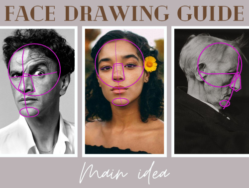

# **Face Drawing Guide**

This project aspire to create an AI tool inspired by Loomis method for art beginners. The goal is to help "art babies" see the guidlines and shapes in faces which can help them to learn how to draw a face on their own.

A functioning demonstration of the code is presented in the `Face_drawing_guide_demo.ipynb` notebook. The *additional codes* folder then contains all .py files used for image annotation and one notebook used for face lendmarking. They will be briefly explained at the end of the readme.

  1. FDG_anot.py is used to interactively draw circles and images inside images and serves as a data annotator.
  2. anot_test.py shows the images with their annotations and exports them.
  3. MediaPipe_landmarks.ipynb finds facial landmarks in images. 
  4. pipe.py serves as a filtering code. It was used to filter the MediaPipe wrongly detected images out of the dataset.
  5. 

The main goal is to divide a face in an uploaded photography into simple shapes. We chose to focus on drawing a circle to represent cranium and an ellipse as a chin. This division is supossed to help sketching the main structure of the face and strenghten the mental library of the artist to draw faces without reference in future if they wish to.

We decided to use a self-constructed dense neural network (NN). The goal was to train a NN which would detect the radius and center coordinates of a circle and ellipse which would best approximate the given face. MediaPipe was later utilized in the training process which resulted in a better performance of the network.

Our project introduces a fully functioning, MedaiPipe dependent neural network approach to face drawing.

